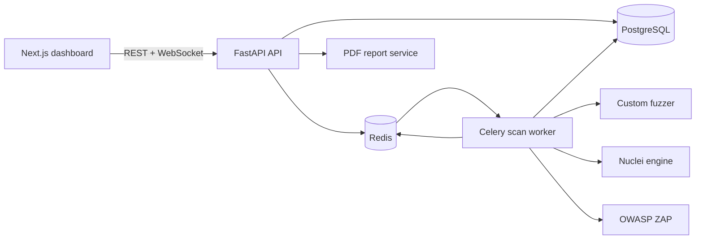

# EthioVuln Technical Architecture

## System Context

## Scan Flow

1. An authenticated user accepts the security disclaimer and submits a target.
2. The target verifier validates the scheme, resolves DNS, and rejects private,
   loopback, link-local, reserved, and blocked internal destinations.
3. The API persists a pending scan and queues a Celery task through Redis.
4. The worker runs the selected engines and publishes progress, logs, and
   findings over Redis Pub/Sub.
5. Findings are normalized into a common vulnerability record with severity,
   CVSS, CWE, evidence, request data, response data, and remediation.
6. The dashboard polls scan state and subscribes to the scan WebSocket channel.
7. Completed scans can be exported as PDF reports.

## Detection Coverage

| Detector | Evidence | Primary CWE |
|---|---|---|
| SQL injection | Database error signatures after parameter probes | CWE-89 |
| Reflected XSS | Unencoded payload reflection in response body | CWE-79 |
| CSRF | Same-origin state-changing form without token marker | CWE-352 |
| Security headers | Missing browser security response headers | CWE-693 / CWE-1021 |
| CORS | Arbitrary Origin reflection or wildcard credentials | CWE-942 |
| Sensitive exposure | Accessible configuration, backup, admin, and metadata paths | CWE-200 |

## Trust Boundaries

- Target validation is a security boundary and must run before any scanner
  request is made.
- Scan tasks run outside the API process and communicate through Redis.
- Findings are scoped to the authenticated user's scan ownership in the API.
- The platform must only be used against targets with explicit authorization.